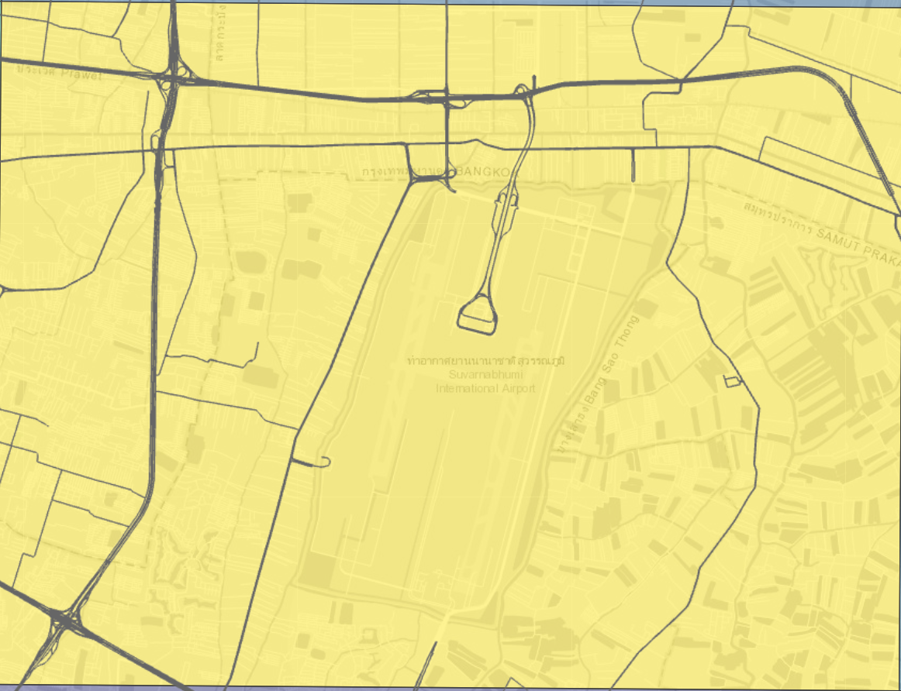

## 1. Introduction and Study Context

Road traffic accidents are among the most persistent and spatially patterned public-safety problems facing rapidly urbanising and urbanised regions. Unlike many other point-based public-safety events, traffic accidents are constrained to occur on the road network rather than freely across the two-dimensional landscape . This structural feature of the data has direct consequences for which analytical methods are valid.

This report investigates the spatial distribution of road traffic accidents recorded in **2022** across the **Bangkok Metropolitan Region (BMR)**, comprising Bangkok, Nonthaburi, Nakhon Pathom, Pathum Thani, Samut Prakan and Samut Sakhon. First-order and second-order spatial point pattern analysis (SPPA), with a network-constrained treatment justified by the road-bound nature of the event will be used.

## 2. Research Questions and Objectives

**Primary research questions:**

a.  Do road traffic accidents in the BMR occur with uniform intensity across space, or are they concentrated in identifiable areas (first-order property)?

b.  Do accidents exhibit evidence of spatial interaction, i.e., clustering, inhibition or approximate randomness, relative to an appropriate network-constrained null model (second-order property)?

**Objectives:**

a.  Prepare and integrate real-world geospatial data for point-pattern analysis.
b.  Investigate first-order properties of the accident point pattern across space.
c.  Investigate second-order properties using both planar and network-constrained methods.
d.  Critically evaluate the assumptions, methodological choices and limitations of the methods used.
e.  Communicate findings through appropriate geovisualisation.
f.  Translate findings into public-safety planning implications.

## 3. Data and Scope of Study

## 3.1 Datasets

| \# | Dataset | Geometry | Role | Source |
|---------------|---------------|---------------|---------------|---------------|
| 1 | `geoBoundaries-THA-ADM1-all.shp` | Multi-polygon | Define the BMR study region (six provinces) | [Thailand ADM1 Geoboundaries](https://github.com/wmgeolab/geoBoundaries/raw/9469f09/releaseData/gbOpen/THA/ADM1/geoBoundaries-THA-ADM1-all.zip) |
| 2 | `thai_road_accident_2019_2022.csv` | Point (event) | Provides 2022 traffic accidents | [Thailand Road Accident 2019 to 2022](https://www.kaggle.com/datasets/thaweewatboy/thailand-road-accident-2019-2022) |
| 3 | `gis_osm_roads_free_1.shp` | Line | Provides road networks (main roads) | [OpenStreetMap for Thailand](https://download.geofabrik.de/asia/thailand.html) |

## 3.2 Point Event Definition

A point event in this study is a single recorded road traffic accident occurring in 2022 within the BMR, represented by its reported latitude/longitude. The source data records one row per accident and includes information on the type of vehicle, accident details and casualties.

## 3.3 Data-Quality Handling Applied to Point Events:

To prepare the data sets for analysis, the following data-quality handling was applied for the traffic accident point event data set `thai_road_accident_2019_2022.csv`:

a.  **Filtering out point events within boundary and temporal points in 2022:** (see section 4.3.2) Based on the province names under `province_en` and `incident_datetime`, observations outside the study area and temporal period are filtered out.

b.  **Missing values:** (see section 4.3.4) There are 189 records that are missing latitude and longitude data in the data set, which were filtered out.

c.  **Erroneous values:** (see section 4.3.4) Under the field `number_of_vehicles_involved`, there were five records indicating zero vehicles were involved in the traffic accident. The details were explored and these appeared to be data entry errors as the accident descriptions mentioned collisions. These five records were treated as data entry errors but retained, considering there woould not be any analysis involving number of vehicles.

d.  **Duplicate observations:** (see section 4.3.4) Using the values in `acc_code` which provided a unique ID for each traffic accident, the *distinct()* function was used to check and remove any duplicate event point. There was no duplicate event point identified.

e.  **Invalid coordinates or geometries:** (see section 4.4) Four event points that were misaligned or located outside the study area were dropped by subsetting the ppp point object against the owin object.

f.  **Overlapping observations:** (see section 4.4) Even after removing duplicate observations, there might be point events of different traffic accidents that overlap. Using *rjitter()*, these point events would be moved by one meter.

## 3.4 Spatial Study Window

The spatial study window was made up of six BMR provinces (Bangkok, Nonthaburi, Nakhon Pathom, Pathum Thani, Samut Prakan, Samut Sakhon), dissolved into a single polygon. This boundary was used as the owin for planar spatstat analysis and the clipping extent for the road network and traffic accident point events.

## 4. Data Preparation

```{r}
pacman::p_load(sf, terra, spatstat, spNetwork, tmap, tidyverse, dplyr, units, lubridate)
```

### 4.1 Geographical Boundary of BMR

#### 4.1.1 Importing geographical boundary data

Prior to preparing the geospatial analytical workspace, it is important to check the details of the dataset. This would aid in the extraction of the provinces in BMR into a shapefile `bmr`.

*st_transform(crs = 32647)* reprojects the data into WGS 84 / UTM Zone 47N (Klokan Technologies GmbH (https://www.klokantech.com/), n.d.).

```{r}
adm1 <- st_read("data/geospatial/geoBoundaries-THA-ADM1-all/geoBoundaries-THA-ADM1.shp") %>%
  st_transform(crs = 32647)
```

```{r}
str(adm1)
```

```{r}
adm1[["shapeName"]]
```

#### 4.1.2 Filtering to BMR boundary

By obtaining the values in the province field, the BMR provinces could be filtered to derive the data set `bmr`.

```{r}
bmr_provinces <- c(
  "Bangkok",
  "Nonthaburi Province",
  "Pathum Thani Province",
  "Samut Prakan Province",
  "Nakhon Pathom Province",
  "Samut Sakhon Province"
)

bmr <- adm1 %>%
  filter(shapeName %in% bmr_provinces) %>%
  st_make_valid() %>%             
  st_union() %>%                  
  st_as_sf(crs = st_crs(adm1)) %>% 
  mutate(name = "Bangkok Greater Metropolitan Area")
```

### 4.2 Road Networks in BMR

#### 4.2.1 Importing road network data

Similarly, the road networks data set was checked in order to correctly filter the required data. For the purpose of this analysis, we used only main roads.

```{r}
roads_raw <- st_read("data/geospatial/thailand-260911-free.shp/gis_osm_roads_free_1.shp")%>%
  st_transform(crs = 32647)
```

```{r}
str(roads_raw)
```

```{r}
sort(unique(roads_raw$fclass))
```

#### 4.2.2 Filtering to main road classes

Based on the values in `fclass`, main roads (Kaart: Road Classifications Guide - OpenStreetMap Wiki, n.d.) were filtered out.

```{r}
main_road_classes <- c(
  "motorway",
  "motorway_link",
  "trunk",
  "trunk_link",
  "primary",
  "primary_link",
  "secondary",
  "secondary_link",
  "tertiary",
  "tertiary_link"
)

roads_select <- roads_raw %>%
  filter(fclass %in% main_road_classes)
```

#### 4.2.3 Filtering road networks to BMR boundary

The road networks was filtered to the BMR boundary using *st_crop()* based on the boundary defined in `bmr`.

```{r}
roads_bmr <- roads_select %>% 
  st_crop(bmr) %>% 
  st_intersection(bmr) 
```

The boundary and road networks were plotted for a visual check.

```{r}
tm_shape(bmr) + tm_polygons(col = "grey95") +
  tm_shape(roads_bmr) + tm_lines(col = "steelblue", lwd = 0.5)
```

### 4.3 2022 Traffic Accidents in BMR

#### 4.3.1 Importing traffic accident data set

The traffic accident data was imported using *read_csv()*. As the study is confined to 2022 event points, the columns were checked to facilitate the filtering.

```{r}
accident_full <- read_csv("data/aspatial/thai_road_accident_2019_2022.csv")
```

```{r}
head(accident_full)
```

#### 4.3.2 Filtering accident event points to 2022 and BMR boundary

After checking the columns and content, the required data for 2022 in BMR was filtered out as `accident_2022`.

```{r}
bmr_province_names <- c(
  "Bangkok",
  "Nonthaburi",
  "Pathum Thani",
  "Samut Prakan",
  "Nakhon Pathom",
  "Samut Sakhon"
)

accident_2022 <- accident_full %>%
  filter(
    year(incident_datetime) == 2022,
    province_en %in% bmr_province_names
  )
```

#### 4.3.4 Data handling for point events

**Missing Values**

*summary()* was used to check for missing values. It was observed that there were 189 "NA" values in latitude and longtitude. These rows were dropped. Interestingly, there were accident records that had zero vehicles involved in the field `number_of_vehicles_involved`.

```{r}
summary(accident_2022)
```

Using *View()*, five records with zero vehicles involved were explored and these appeared to be data entry errors as the accident descriptions mentioned collisions. These five records were treated as data entry errors but retained, considering there would not be any analysis involving number of vehicles.

```{r}
#| eval: false
accident_2022 %>%
  filter(number_of_vehicles_involved == 0) %>%
  View()
```

Duplicate point events were checked for using the values in `acc_code`, which should be distinct for each traffic accident. There was no duplicate event identified.

```{r}
nrow(accident_2022)

accident_dup <- accident_2022 %>%
  distinct(acc_code, .keep_all = TRUE)

nrow(accident_dup)
```

The data set was transformed into an sf data set, while filtering out the 189 records that had missing latitude and longitude values.

```{r}
accident_sf <- accident_2022 %>% 
  filter(!is.na(latitude), !is.na(longitude)) %>% 
  distinct(longitude, latitude, .keep_all = TRUE) %>%
  st_as_sf(coords = c("longitude", "latitude"), crs = 4326) %>% 
  st_transform(crs = 32647)
```

The three data sets were plotted together for a visual check.

```{r}
tm_shape(bmr) + tm_polygons(col = "grey95") +
  tm_shape(roads_bmr) + tm_lines(col = "steelblue", lwd = 0.5) +
  tm_shape(accident_sf) + tm_dots(fill = "red", col = "red", size = 0.02)
```

An interactive map would allow for a more detailed exploration to ensure that event points fall neatly within the road networks.

::: callout-note
## Note

The interactive map block is set to *eval: FALSE* to minimise computational overhead and reduce report rendering time.
:::

```{r}
#| eval: false
tmap_mode("view")
tm_shape(bmr) + tm_polygons(col = "grey95", fill_alpha = 0.5) +
  tm_shape(roads_bmr) + tm_lines(col = "steelblue", lwd = 0.5) +
  tm_shape(accident_sf) + tm_dots(fill = "red", col = "red", size = 0.2)
```

```{r}
#| eval: false
tmap_mode("plot")
```

### 4.4 Conversion to owin and ppp

The sf data set was converted to owin and ppp, which were required for SPPA. A check on the number of event points from `accident_sf` using *nrow()* was for comparison with event points after owin clipping.

```{r}
nrow(accident_sf)
```

After owin clipping, there was a drop in four event points, from 3,272 to 3,268. This was a result of the accident event points outside the `bmr` boundary, even though they were labelled as BMR province in the data set. This handled the point events that fell outside the boundary.

*rjitter()* from spadstat package was also used for point events of different traffic accidents that happened to overlap by moving them by 1 meter. Unlike *st_jitter*, the argument *retry = TRUE* in *rjitter()* addressed the possibility of a point event accidentally colliding with another after jittering. Based on the output, there was no point event that overlapped.

```{r}
bmr_owin <- as.owin(bmr)

accident_ppp <- as.ppp(accident_sf)
accident_ppp_bmr <- accident_ppp[bmr_owin]

cat("Overlap points detected:", sum(duplicated(accident_ppp_bmr)), "\n")

if (any(duplicated(accident_ppp_bmr))) {
  accident_ppp_bmr <- rjitter(
    accident_ppp_bmr, 
    retry = TRUE,   
    nsim = 1, 
    drop = TRUE
  )
  cat("Overlap points remaining after jittering:", sum(duplicated(accident_ppp_bmr)), "\n")
}

accident_ppp_bmr
```

*rescale.ppp()* was used to re-scaled to kilometers to make the statistical output more interpretable. This is particularly relevant for accident events, as using meters may result in an output of less than one accident.

```{r}
accident_ppp_km <- rescale.ppp(accident_ppp_bmr, 1000, "km")
```

## 5. First-Order SPPA

To examine the first-order spatial distribution of road traffic accidents in BMR, a planar Quadrat Analysis is conducted as a primary exploratory step. A network-based quadrat method segments the road network in order to aggregate point events along it (Shiode, 2008). However, it appears to be appropriate only for a smaller geometry boundary. Using the *quadratcount()* from spadstat.linnet package on the BMR road network resulted in about 250,000 line segments, which was computationally challenging to run as no output was produced even after more than 10 minutes (Baddeley et al., n.d.). Instead, a planar quadrat analysis was conducted to evaluate spatial variation and test for Complete Spatial Randomness (CSR) using a Chi-square goodness-of-fit test.

Complementing this, Network Kernel Density Estimation (NKDE) is applied. Traffic accidents are constrained to linear transport infrastructure rather than freely distributed across 2D space. NKDE adapts conventional density estimation by calculating accident intensity along network segments using shortest-path network distances rather than Euclidean distances (Okabe et al., 2009). Combining network-adjusted quadrat partitioning with NKDE prevents false density artifacts in planar spaces, offering a realistic representation of traffic accident risk along BMR's road networks.

### 5.1 Quadrat Analysis

To detect non-random accident clustering across a road network, quadrat analysis divides the study area into a regular grid and compares observed cell counts against a Poisson distribution CSR using Chi-square.

#### 5.1.1 Chi-square quadrat test

The *quadratcount()* from spadstat package was used to divid the study area into an 8 x 8 grid and count the number of accident point events in each cell.

```{r}
qcount <- quadratcount(accident_ppp_km, nx = 8, ny = 8)

plot(accident_ppp_km, pch = 20, cex = 0.3, main = "Quadrat Count of Accidents")
plot(qcount, add = TRUE, cex = 0.8, col = "red")

qcount_intensity <- intensity(qcount)
```

```{r}
quadrat.test(accident_ppp_km, nx = 8, ny = 8)
```

With a p-value of \< 0.05 from the chi-square quadrat test, the null hypothesis of CSR is rejected. This indicates that traffic accidents are not uniformly distributed across the BMR under a planar model, which is expected given that accidents are confined to a road network.

#### 5.1.2 Plotting Accident Intensity

An 8×8 rectangular grid was generated over the BMR boundary and clipped to its irregular extent using *st_intersection()*, so quadrats along the study area's edge reflect their true partial area. Accident counts per quadrat were obtained using *st_intersects()*, and intensity was calculated as accident count divided by each quadrat's clipped area in km².

::: callout-note
## AI Use Disclosure

Generative AI was used to draft the R code for constructing the 8 × 8 quadrat grid over the BMR boundary and calculating accident intensity (accidents per km²) per quadrat. The output was reviewed and run by the author to verify correctness against the study data.
:::

```{r}
accident_bmr <- accident_sf %>%
  st_filter(bmr, .predicate = st_within)

grid_bmr <- st_make_grid(bmr, n = c(8, 8)) %>%
  st_sf(quadrat_id = seq_along(.), geometry = .) %>%
  st_intersection(bmr)

grid_bmr <- grid_bmr %>%
  mutate(
    accident_count = lengths(st_intersects(., accident_bmr)),
    area_km2 = as.numeric(st_area(.)) / 1e6,
    intensity = accident_count / area_km2
  )

tmap_mode("plot")
tm_shape(grid_bmr) +
  tm_polygons(
    fill = "intensity",
    fill.scale = tm_scale_continuous(values = "viridis"),
    fill.legend = tm_legend(title = "Accidents/km²",
                            text.size = 1, 
                            width = 6)) +
  tm_shape(roads_bmr) + tm_lines(col = "grey40", lwd = 0.2) +
  tm_title("Quadrat Intensity of Accidents (8×8 grid)") +
  tm_layout(legend.title.size = 1)
```

Quadrat intensity was plotted based on the 8 x 8 grid for visual inspection. There was a clear gradiant concentration in the bottom right, which seems to coincide with the Bangkok province, peaking at 2.5 accidents/km² as represented by the yellow cell. The yellow cell however, appeared to have a higher than normal proportion of accidents considering that it did not have a very dense road network, as compared to the green cells.

An interactive map was plotted to check the infrastructures in the yellow cell.

::: callout-note
## Note

The interactive map block is set to *eval: FALSE* to minimise computational overhead and reduce report rendering time.
:::

```{r}
#| eval: false
tmap_mode("view")

tm_shape(grid_bmr) +
  tm_polygons(
    fill = "intensity",
    fill_alpha = 0.5,
    fill.scale = tm_scale_continuous(values = "viridis"),
    fill.legend = tm_legend(title = "Accidents/km²",
                            text.size = 1,
                            width = 6)) +
  tm_shape(roads_bmr) + tm_lines(col = "grey40", lwd = 0.2) +
  tm_title("Quadrat Intensity of Accidents (8×8 grid)") +
  tm_layout(legend.title.size = 1)
```

```{r}
#| eval: false
tmap_mode("plot")
```

{width="454"}

From the interactive map, the Suvarnabhumi Airport could be seen in the yellow cell. This suggested that there was high traffic concentration despite the relatively shorter road length.

To verify the visual observation, road segments were clipped to each quadrat using *st_intersection()* and their lengths measured using *st_length()*. *group_by()* and *summarise(sum())* were then used to compute total road length per cell. Dividing accident count by road length would show how many accidents occur per kilometre of road, so cells with elevated risk could be told apart from cells that simply have a denser road network.

::: callout-note
## AI Use Disclosure

Generative AI was used to draft the R code for for clipping road segments to each quadrat and summing road length per cell. The output was reviewed and run by the author to verify correctness against the study data.
:::

```{r}
road_lengths_by_quadrat <- roads_bmr %>%
  st_intersection(grid_bmr) %>%
  mutate(seg_length_km = as.numeric(st_length(.)) / 1000) %>%
  st_drop_geometry() %>%
  group_by(quadrat_id) %>%
  summarise(road_length_km = sum(seg_length_km), .groups = "drop")

grid_bmr <- grid_bmr %>%
  select(-any_of(c("road_length_km", "accidents_per_km_road"))) %>%
  left_join(road_lengths_by_quadrat, by = "quadrat_id") %>%
  mutate(
    road_length_km = replace_na(road_length_km, 0),
    accidents_per_km_road = accident_count / road_length_km
  )

grid_bmr %>%
  st_drop_geometry() %>%
  arrange(desc(intensity)) %>%
  select(quadrat_id, accident_count, area_km2, intensity, road_length_km, accidents_per_km_road) %>%
  head(10)
```

Quadrats were ranked by intensity to identify the top 10 highest-accident-density cells. The table confirms the visual observation that the yellow cell, i.e., quadrat_id 23, has an accident count of 470 for its 378km of roads. It has 1.24 accidents per km of road, compared to the next highest at 0.47.

### 5.2 Network Kernel Density Estimate (NKDE)

NKDE to estimating the density of such spatial point events, through search bandwidth selection and lixel length

https://www.sciencedirect.com/science/article/abs/pii/S0198971508000318

network quardrat analysis

Kernel density estimation (KDE) is then applied in two forms for the same reason, i.e., a planar KDE surface is retained as an exploratory baseline, while a network-constrained KDE (NKDE) is treated as the primary first-order method, since it estimates intensity along the network itself rather than across the full 2-D plane. This avoids the systematic bias of interpreting uneven road density as uneven accident risk.

#### 5.2.1 Bandwidth selection

The objective of performing KDE is to determine the optimal estimate of the density of the process, as it impacts the data that is being smoothed. A bandwidth that is too small reproduces individual points, resulting in noise rather than a pattern, while too large would smooth away point events into a blob. Thus, bandwidth selection will impact the estimator (McSwiggan & Department of Mathematics and Statistics, UWA, 2019).

The use of *density()* requires an indicated bandwidth. The bandwidth was calculated using four different methods and plotted for visual inspection.

```{r}
bw.diggle(accident_ppp_km)
bw.CvL(accident_ppp_km)
bw.scott(accident_ppp_km)
bw.ppl(accident_ppp_km)
```

```{r}
#| fig-width: 10
#| fig-height: 6

kde_diggle <- density(accident_ppp_km, sigma = bw.diggle, edge = TRUE)
kde_cvl    <- density(accident_ppp_km, sigma = bw.CvL, edge = TRUE)
kde_scott    <- density(accident_ppp_km, sigma = bw.scott, edge = TRUE)
kde_ppl    <- density(accident_ppp_km, sigma = bw.ppl, edge = TRUE)

par(mfrow = c(2, 2))
plot(kde_diggle, main = "bw.diggle")
plot(kde_cvl, main = "bw.CvL")
plot(kde_scott, main = "bw.scott")
plot(kde_ppl, main = "bw.ppl")
```

**Interpretation.** Comparing the four bandwidth selectors visually rather than by their sigma values alone reveals a clearer picture. bw.diggle and bw.ppl (0.023 km and 0.75 km respectively) both produce maps that trace the underlying road network, with narrow bright lines following street shapes rather than distinct hotspot regions. This indicates under-smoothing, where the estimate at each location is driven by only the handful of nearest accident points. bw.CvL and bw.scott (7.06 km and 4-5 km) instead collapse the pattern into a single broad, diffuse blob covering a large area. This indicates over-smoothing.

None of the bandwidth selector produces a map suited to identifying discrete, actionable hotspots. This demonstrates that a purely planar kernel density approach struggles to find a bandwidth that meaningfully separates "accident risk" from "road network shape" in data that is inherently constrained to the road network.

bw.ppl is selected as the working bandwidth for the exploratory planar KDE baseline as it is the least extreme under-smoother and the closest to providing some accident point details. The output is treated as a baseline for comparison rather than the primary first-order evidence. This finding directly reinforces the report's methodological decision to rely on Network KDE (NKDE) as the primary first-order method, since NKDE smooths intensity along the network itself and is therefore not subject to the same trade-off between tracing the road pattern and diffusing it into a blob.

https://api.research-repository.uwa.edu.au/ws/portalfiles/portal/81039500/THESIS_DOCTOR_OF_PHILOSOPHY_MCSWIGGAN_Gregory_Edward_2020.pdf (use of diggle)

#### 5.1.2 Lixel

### 5.4 Network KDE (NKDE)

```{r}
roads_bmr <- roads_bmr %>%
  st_cast("MULTILINESTRING") %>%
  st_cast("LINESTRING")

class(st_geometry(roads_bmr))
```

REVIEW BELOW CODE

```         
lixels_bmr <- lixelize_lines(roads_bmr, 200, mindist = 100)

samples_bmr <- lines_center(lixels_bmr)

nkde_bmr <- nkde(
  lines = roads_bmr,
  events = accident_bmr,
  w = rep(1, nrow(accident_bmr)),
  samples = samples_bmr,
  kernel_name = "quartic",
  bw = 500,
  div = "bw.ppl",
  method = "simple",
  digits = 1,
  tol = 1,
  grid_shape = c(50, 50),
  max_depth = 8,
  agg = 5,
  sparse = TRUE,
  verbose = FALSE
)
```

```         
samples_bmr$density <- nkde_bmr
samples_bmr_sf <- st_as_sf(samples_bmr)

tm_shape(bmr) + tm_polygons(col = "grey95") +
  tm_shape(samples_bmr_sf) +
  tm_dots(
    fill = "density",
    fill.scale = tm_scale_intervals(style = "quantile", values = "viridis"),
    fill.legend = tm_legend(title = "NKDE Density"),
    size = 0.05
  ) +
  tm_layout(
    main.title = "Network KDE of Accidents — BMR (bw = 500 m)",
    main.title.size = 1,
    legend.outside = TRUE
  )
```

## 6. Second-Order SPPA

Network Constrained G- and K-Function Analysis

K-means clustering to identify hotspots https://pubmed.ncbi.nlm.nih.gov/19393780/

## 7. Value-Added Analysis

Moran's I for spatial pattern of road accidents (second-order) https://www.sciencedirect.com/science/article/abs/pii/S0966692397000379

https://opentransportationjournal.com/VOLUME/20/ELOCATOR/e26671212488767/FULLTEXT/

## References

Baddeley, A., Turner, R., & Rubak, E. (n.d.). quadratcount: Quadrat counting for a point pattern on a linear network. Rdocumentation. https://www.rdocumentation.org/packages/spatstat.linnet/versions/3.5-0/topics/quadratcount

*Download OpenStreetMap for Thailand \| Geofabrik Download Server*. (n.d.). Geofabrik Download Server. https://download.geofabrik.de/asia/thailand.html

Kaart: Road Classifications Guide - OpenStreetMap Wiki. (n.d.). https://wiki.openstreetmap.org/wiki/Kaart:\_Road_Classifications_Guide

Kam, T. S. R for Geospatial Data Science and Analytics. https://r4gdsa.netlify.app/

Klokan Technologies GmbH (https://www.klokantech.com/). (n.d.). *EPSG.io: Coordinate Systems worldwide*. https://epsg.io/

McSwiggan, G. & Department of Mathematics and Statistics, UWA. (2019). Spatial point process methods for linear networks with applications to road accident analysis. https://api.research-repository.uwa.edu.au/ws/portalfiles/portal/81039500/THESIS_DOCTOR_OF_PHILOSOPHY_MCSWIGGAN_Gregory_Edward_2020.pdf

Nicholson, A. (1998). Analysis of spatial distributions of accidents. Safety Science, 71–91. https://www.sciencedirect.com/science/article/abs/pii/S0925753598000563

Okabe, A., & Yamada, I. (2001). The K-function method on a network and its computational implementation. Geographical Analysis, 33(3), 271–290.

R, T. (2023). *Thailand Road Accident \[2019-2022\]*. Kaggle. https://www.kaggle.com/datasets/thaweewatboy/thailand-road-accident-2019-2022

Runfola D, Anderson A, Baier H, Crittenden M, Dowker E, Fuhrig S, et al. (2020) geoBoundaries: A global database of political administrative boundaries. PLoS ONE 15(4): e0231866. https://doi.org/10.1371/journal.pone.0231866.

Shiode, S. (2008). Analysis of a distribution of point events using the Network‐Based Quadrat Method. Geographical Analysis, 40(4), 380–400. https://doi.org/10.1111/j.0016-7363.2008.00735.x
