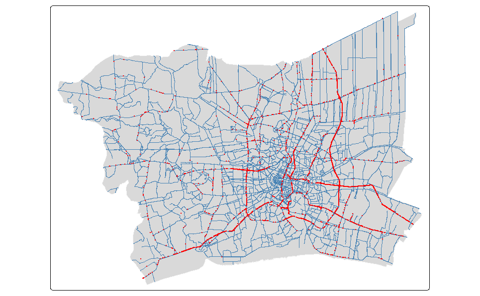
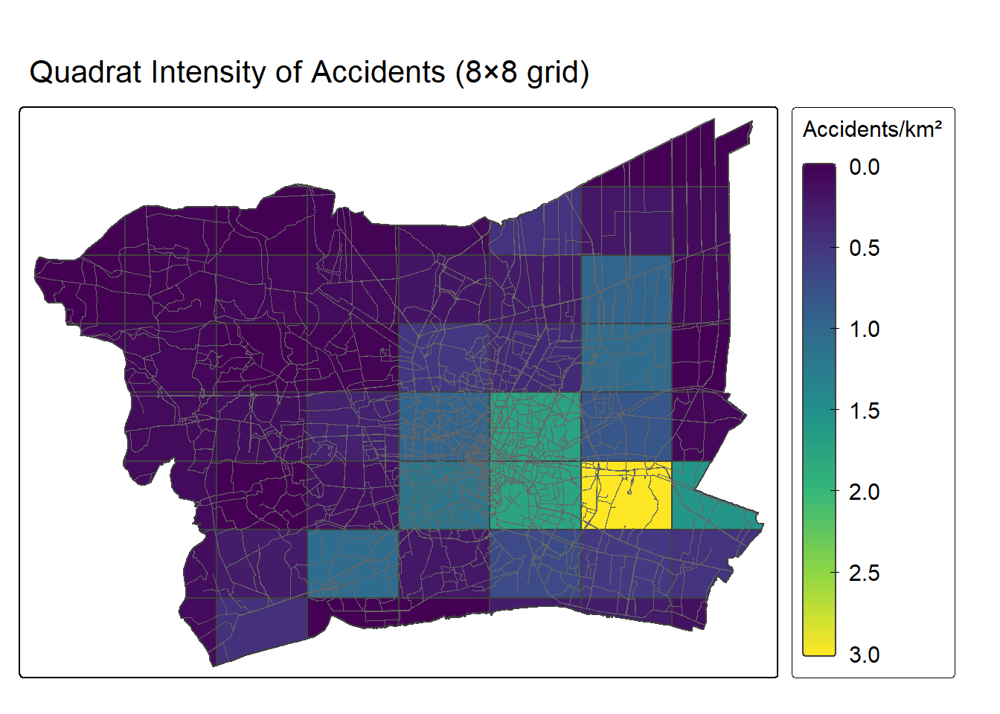
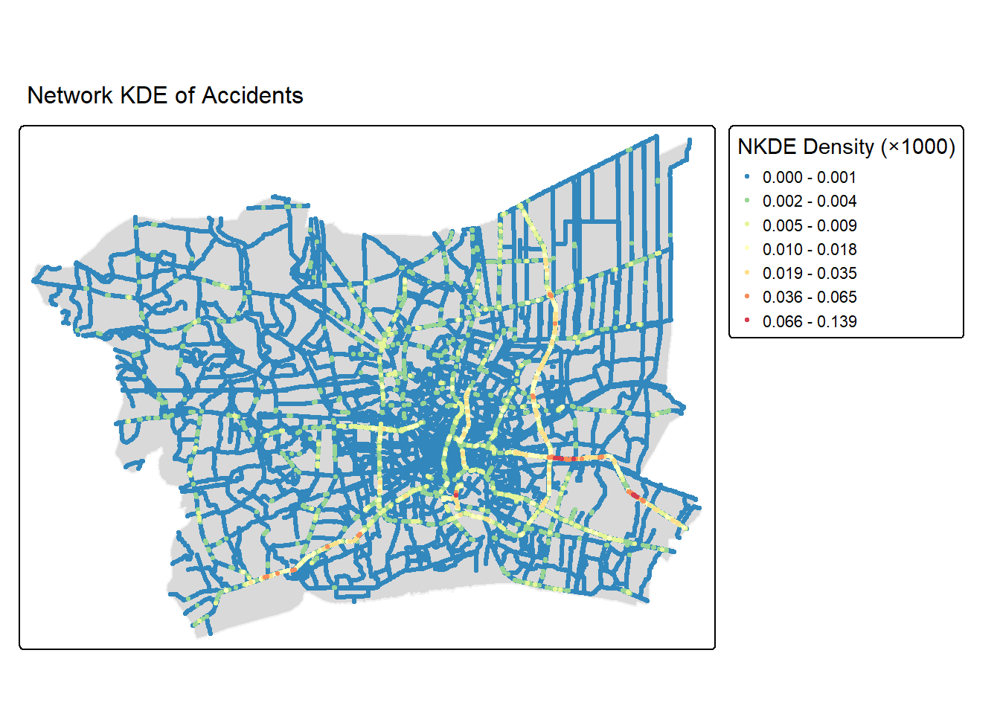
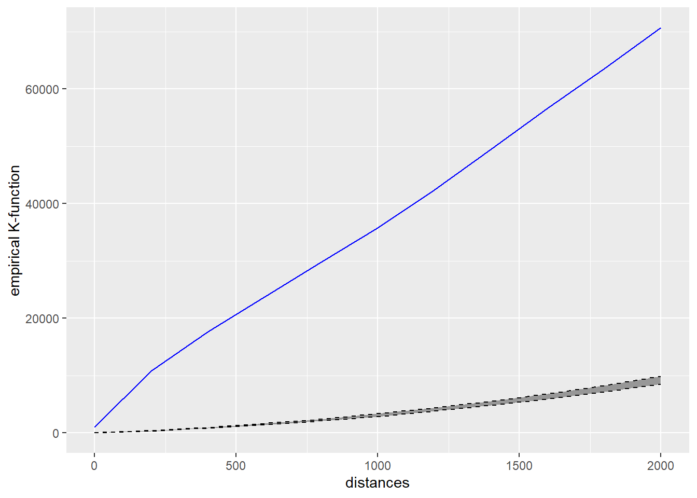
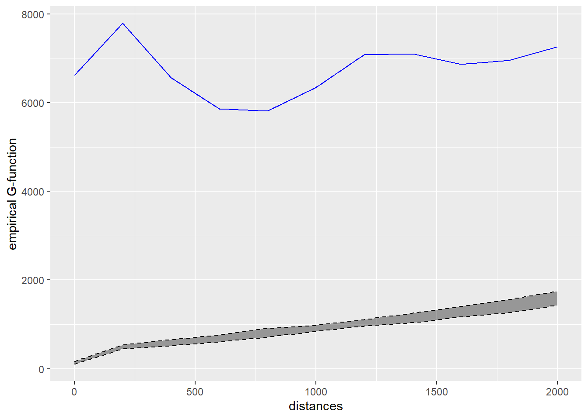

## Overview {.smaller}

### Executive Summary Structure

1.  [Research Questions & Objectives](#/research-questions-objectives)
2.  [Study Area & Spatial Scope](#/study-area-spatial-scope)
3.  [Data Sources & Quality Handling](#/data-sources-quality-handling)
4.  [Analytical Approach: First-Order SPPA](#/analytical-approach-first-order-sppa)
5.  [Analytical Approach: Second-Order SPPA](#/analytical-approach-second-order-sppa)
6.  [Analytical Approach: Value-Added Analysis](#/analytical-approach-value-added-analysis)
7.  [Key Spatial Findings](#/key-spatial-findings)
8.  [Visual Evidence: Hotspot & Corridor Risk](#/visual-evidence-hotspot-corridor-risk)
9.  [Public-Safety Implications & Recommendations](#/public-safety-implications-recommendations) 
10. [Methodological Limitations](#/methodological-limitations)

------------------------------------------------------------------------

## 1. Research Questions & Objectives{.smaller}

### Primary Research Questions

- **First-Order Property:** Do 2022 traffic accidents across the Bangkok Metropolitan Region (BMR) occur with uniform intensity, or do they form distinct spatial hot spots?
- **Second-Order Property:** Do accident point patterns show statistically significant spatial interaction (clustering or inhibition) when constrained to the physical road network?

### Core Analytical Objectives

1.  Integrate spatial boundaries, road networks and accident point events for geospatial data analysis.
2.  Investigate first-order properties using planar (quadrat analysis) and networked-constrained (NKDE) methods.
3.  Investigate second-order properties using network-constrained K- and G-functions.
4.  Translate analysis insights into public-safety recommendations.

------------------------------------------------------------------------

## 2. Study Area & Spatial Scope{.smaller}

::: panel-tabset
### Spatial Boundary

- **Study Window:** Bangkok Metropolitan Region (BMR), Thailand.
- **Provinces Included (6):** Bangkok, Nonthaburi, Pathum Thani, Samut Prakan, Nakhon Pathom and Samut Sakhon.
- **Coordinate Reference System:** Reprojected to WGS 84 / UTM Zone 47N (EPSG: 32647).

### BMR Map

{fig-align="center" width="80%"} 
:::

------------------------------------------------------------------------

## 3. Data Sources & Quality Handling{.smaller}

### Datasets Used

- **Boundaries:** `geoBoundaries-THA-ADM1-all.shp` (Province limits).
- **Accidents:** `thai_road_accident_2019_2022.csv` (Point events).
- **Roads:** `gis_osm_roads_free_1.shp` (Filtered to main road classes).

### Data Quality & Pre-processing

- **Temporal & Spatial Subsetting:** Extracted 2022 records strictly within BMR boundaries.
- **Missing & Erroneous Values:** Removed 189 records missing coordinate attributes. Retained 5 records with 0 recorded vehicles after verifying descriptions.
- **Spatial Alignment & Overlaps:** Filtered 4 points falling outside the boundary window. Applied jittering (`rjitter()`) to resolve co-located coordinates but no point event was affected. Final dataset: **3,589 accident points**.

------------------------------------------------------------------------

## 4. Analytical Approach: First-Order SPPA{.smaller}

::: panel-tabset
### Planar Quadrat Analysis

  - Exploratory step for chi-square and intensity visual observation
  - p-value of < 0.05, thus rejecting null hypothesis of CSR
  - One cell with extreme intensity value, where Suvarnabhumi Airport is located
{.absolute top="170" left="30" fig-alt="bmr_plot" fig-align="center"}
  
### Network Kernel Density Estimate 

  - Estimates density using shortest-path distances along the network
  - Observed density concentrating heavily along a small number of specific roads, with the brightest red segments in the same areas as the quadrat analysis
{.absolute top="170" left="30" fig-alt="bmr_plot" fig-align="center"}

------------------------------------------------------------------------

## 5. Analytical Approach: Second-Order SPPA{.smaller}

::: panel-tabset
### Network K-Function

  - Evaluated multi-scale spatial clustering or dispersion of accidents along network distances.
  - Compared observed point distribution against a Monte Carlo simulated null hypothesis of CSR.
  - Observed blue line sits definitively above the simulation envelope across the entire 0 to 2000m range tested. Null hypothesis was rejected,
{.absolute top="170" left="30" fig-alt="bmr_plot" fig-align="center"}

### Network G-function

  - Measured nearest-neighbor distance distributions along network edges.
  - Complements K-function finding to check clustering at difference distances
  - Observed blue line sits definitively above the simulated envelope, across the entire 0 to 2000m range tested. Null hypothesis rejected.
  {.absolute top="170" left="30" fig-alt="bmr_plot" fig-align="center"}
:::

------------------------------------------------------------------------

## 6. Analytical Approach: Value-Added Analysis{.smaller}

::: {.panel-tabset}
### Local Moran's I (LISA)
* **Objective:** Evaluate whether quadrat 23 (Suvarnabhumi Airport area) represents a statistically significant **High-High spatial cluster** or an isolated spatial outlier relative to surrounding grid cells.
* **Findings:** Identifies statistically significant local spatial autocorrelation ($p < 0.05$), confirming that high accident rates in the airport corridor are spatially systemic rather than random chance.

```{r}
#| label: fig-lisa-map
#| fig-alt: "LISA cluster map showing High-High accident hotspots around Suvarnabhumi Airport (Quadrat 23)."
#| echo: false
# Placeholder: Insert tmap / ggplot code for Local Moran's I cluster map
# tm_shape(quadrat_lisa) + tm_polygons(col = "quadrant", palette = "Set1")
```

------------------------------------------------------------------------

## 7. Key Findings{.smaller}

### Spatial Distribution & Intensity

- Traffic accidents across BMR are **non-random and highly clustered** along primary arterial road corridors.
- Core urban centers and major expressways/interchanges exhibit significant density spikes compared to peripheral roads.

### Network Constraints & Clustering

- **Significant Clustering:** Network K-function simulations demonstrate statistically significant clustering at multiple network distance bands ($p < 0.05$).
- High-density clusters concentrate along main transit corridors connecting Bangkok to adjoining industrial and suburban provinces (Pathum Thani, Samut Prakan, and Samut Sakhon).

------------------------------------------------------------------------

## 8. Visual Evidence & Hotspots{.smaller}

### Empirical Highlights

- **Corridor Concentration:** High-risk segments strictly coincide with high-capacity road classes (motorways, trunks, primary roads).
- **Spatial Distribution:**
  - Primary hotspots cluster densely around major suburban entry/exit routes and primary intersections in Bangkok.
  - Rural/secondary road networks exhibit low, dispersed baseline accident frequencies.
- **Geovisualization Integration:** Combined `tmap` network density visualizations clearly highlight spatial disparities in risk that unconstrained planar maps obscure.

------------------------------------------------------------------------

## 9. Public-Safety Implications & Recommendations

::: {.panel-tabset}

### Public-Safety Implications
Targeted Enforcement: Deploy automated speed cameras and traffic enforcement along identified high-density NKDE arterial corridors rather than uniform district distribution.

Optimized EMS Placement: Position Emergency Medical Services (EMS) response units near critical inter-provincial highway interchanges to cut emergency response times.

Engineering Audits: High-density accident corridors highlight structural road engineering flaws (e.g., risky lane merges, poor lighting, or missing pedestrian crossings).

###  Recommendations
Prioritise Infrastructure Audits: Focus road safety investments and structural redesign on top-quantile NKDE risk corridors.

Dynamic Spatiotemporal Models: Expand SPPA modeling to include temporal slicing (rush-hour vs. overnight and rainy season).

Cross-Border Safety Task Force: Form a joint traffic safety council spanning Bangkok, Pathum Thani, Samut Prakan, and Nonthaburi to co-manage shared high-risk inter-provincial highways.
:::

------------------------------------------------------------------------

## 10. Methodological Limitations{.smaller}

### Analytic & Data Constraints

- **Road Network Simplification:** Analysis was restricted to main road classifications (motorway, trunk, primary, secondary, tertiary), excluding local service roads.
- **Reporting & Location Bias:** Reliance on GPS coordinates reported in primary accident logs; minor spatial misalignments or geo-referencing errors may exist.
- **Temporal Aggregation:** 2022 accident data was analyzed as a single static cross-section, masking diurnal, seasonal, or day-of-week temporal fluctuations.
- **Attribute Depth:** Analysis focuses primarily on point location and network topology, without modeling vehicle speed, road geometry (curvature), or weather interactions.

