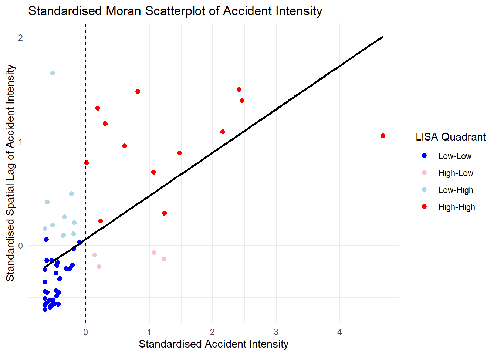
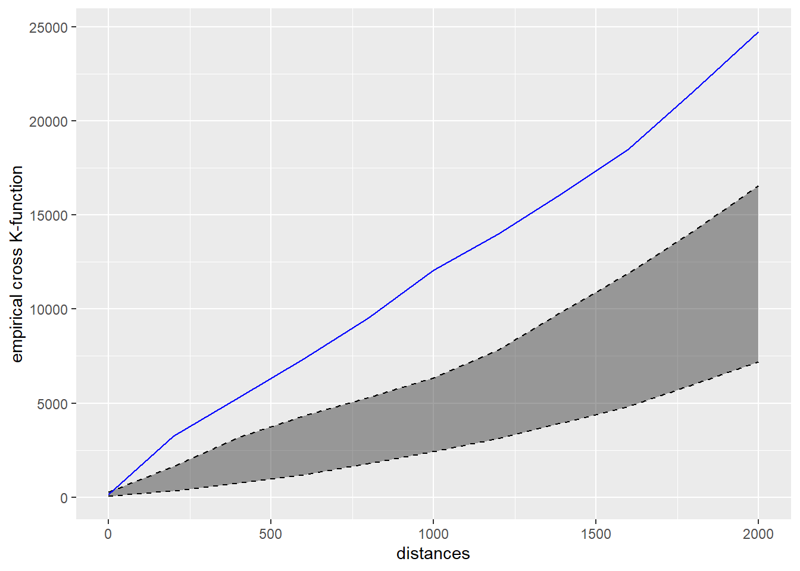
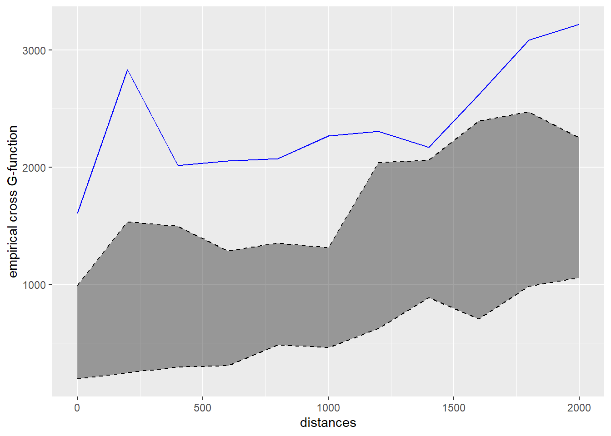

## Overview {.smaller}

### Executive Summary Structure

1.  [Research Questions & Objectives](#research-questions-objectives)
2.  [Study Area & Spatial Scope](#study-area-spatial-scope)
3.  [Data Sources & Quality Handling](#data-sources-quality-handling)
4.  [Analytical Approach: First-Order SPPA](#analytical-approach-first-order-sppa)
5.  [Analytical Approach: Second-Order SPPA](#analytical-approach-second-order-sppa)
6.  [Analytical Approach: Value-Added Analysis](#analytical-approach-value-added-analysis)
7.  [Key Spatial Findings](#key-spatial-findings)
8.  [Recommendations](#recommendations) 
9.  [Methodological Limitations](#methodological-limitations)
10. [References](#references)

------------------------------------------------------------------------

## 1. Research Questions & Objectives {.smaller}

### Primary Research Questions

- **First-Order Property:** Do 2022 traffic accidents across the Bangkok Metropolitan Region (BMR) occur with uniform intensity, or do they form distinct spatial hot spots?
- **Second-Order Property:** Do accident point patterns show statistically significant spatial interaction (clustering or inhibition) when constrained to the physical road network?

### Core Analytical Objectives

1.  Integrate boundaries, road networks and accident point events for analysis.
2.  Investigate first-order properties using planar (quadrat analysis) and networked-constrained (NKDE) methods.
3.  Investigate second-order properties using network-constrained K- and G-functions.
4.  Translate analysis insights into public-safety recommendations.

------------------------------------------------------------------------

## 2. Study Area & Spatial Scope {.smaller}

::: panel-tabset
### Spatial Boundary

- **Study Window:** Bangkok Metropolitan Region (BMR), Thailand.
- **Provinces Included (6):** Bangkok, Nonthaburi, Pathum Thani, Samut Prakan, Nakhon Pathom and Samut Sakhon.
- **Coordinate Reference System:** Reprojected to WGS 84 / UTM Zone 47N (EPSG: 32647).

### BMR Map

{fig-align="center" height="80%" width="80%"}
:::

------------------------------------------------------------------------

## 3. Data Sources & Quality Handling {.smaller}

### Datasets Used

- **Boundaries:** `geoBoundaries-THA-ADM1-all.shp` (Province limits).
- **Accidents:** `thai_road_accident_2019_2022.csv` (Point events).
- **Roads:** `gis_osm_roads_free_1.shp` (Filtered to main road classes).

### Data Quality & Pre-processing

- **Temporal & Spatial Subsetting:** Extracted 2022 records strictly within BMR boundaries.
- **Missing & Erroneous Values:** Removed 189 records missing coordinate attributes. Retained 5 records with 0 recorded vehicles after verifying descriptions.
- **Spatial Alignment & Overlaps:** Filtered 4 points falling outside the boundary window. Applied jittering (`rjitter()`) to resolve co-located coordinates but no point event was affected. Final dataset: **3,589 accident points**.

------------------------------------------------------------------------

## 4. Analytical Approach: First-Order SPPA {.smaller}

::: panel-tabset
### Planar Quadrat Analysis

  - Exploratory step for chi-square and intensity visual observation
  - p-value of < 0.05, thus rejecting null hypothesis of CSR
  - One cell with extreme intensity value, i.e., quadrat where Suvarnabhumi Airport is
  {fig-align="center" height="70%" width="70%"}
  
### Network Kernel Density Estimate 

  - Estimates density using shortest-path distances along the network
  - Observed density concentrating heavily along a small number of specific roads, with the brightest red segments in the same areas as the quadrat analysis, i.e., quadrat 23
  {fig-align="center" height="70%" width="70%"}

:::

------------------------------------------------------------------------

## 5. Analytical Approach: Second-Order SPPA {.smaller}

::: panel-tabset
### Network K-function

  - Tested whether accidents cluster with one another beyond what random placement on the network would predict
  - Observed blue line sits definitively above the simulation envelope across the entire 0 to 2000m range tested. Null hypothesis was rejected.
  {fig-align="center" height="70%" width="70%"}

### Network G-function

  - Measured nearest-neighbor distance distributions along network edges.
  - Complements K-function finding to check clustering at difference distances
  - Observed blue line sits definitively above the simulated envelope, across the entire 0 to 2000m range tested. Null hypothesis rejected.
  {fig-align="center" height="70%" width="70%"}

:::

------------------------------------------------------------------------

## 6. Analytical Approach: Value-Added Analysis {.smaller}

To answer two follow-up questions: is the hotspot a real cluster or an outlier, and do fatal accidents cluster with the non-fatal accidents

::: panel-tabset
### Local Moran’s I

  - Tested whether quadrat 23’s elevated accident rate reflects a broader area cluster.
  - Observed clear separation of groups in scatterplot.
  - Reinforces cluster finding that quadrat 23 is the most severe point within a cluster, rather than an isolated spike
  {fig-align="center" height="70%" width="70%"}

### Network Cross-K/G Function: Fatal vs Non-Fatal Accidents

  - Bivariate cross-K/G function, to test whether fatal and non-fatal accidents are spatially associated with one another along the network
  - Fatal accidents consistently occur closer to non-fatal accidents than random co-location would predict
  
  {fig-align="left" height="40%" width="40%"}
  {fig-align="right" height="40%" width="40%"}

:::

------------------------------------------------------------------------

## 7. Key Spatial Findings {.smaller}

### Spatial Distribution & Intensity

- Non-Random Network Clustering: Accidents are strongly concentrated in the central to south-eastern BMR road networks.
- Co-Location of Severity: Cross-K/G analysis shows fatal accidents consistently cluster near non-fatal crashes at short range.
- Network vs. Spatial Resolution: Network KDE successfully refined broad area concentrations (from Quadrat analysis) down to specific high-risk road segments.

### Network Constraints & Clustering

- Statistically Significant Clustering: Network K-function simulations confirm significant spatial aggregation across multiple network distance bands (p < 0.05).
- Local Spatial Autocorrelation: Local Moran’s I confirms these high-intensity segments represent quadrat clusters rather than isolated outliers.

------------------------------------------------------------------------

## 8. Recommendations {.smaller}

- Emergency response: Pre-position resources across the identified cluster (not one point), where fatal and non-fatal accidents co-locate, prioritising response-time reduction there. Needs congestion/peak-hour data to finalise sites.

- Road safety & infrastructure: Quadrat 23's high accident rate despite a smaller road network supports targeted engineering review (signage, speed enforcement, intersections) ahead of higher-road-length areas. Not evidence of a specific design cause — needs site-level assessment.

- Resource allocation: The north-western cold spot suggests lower relative accident demand. Not evidence of lower risk per unit of exposure — exposure data not available.

------------------------------------------------------------------------

## 9. Methodological Limitations {.smaller}

### Analytic & Data Constraints

- Road Network Simplification: Restricted to main road classes (motorway, trunk, primary, secondary, tertiary), excluding minor/service roads.

- Coordinate Data Quality: 189 records with missing coordinates were dropped, and 4 points fell outside the study boundary despite being labelled within it — some residual geo-referencing imprecision may remain.

- No Exposure Normalisation: Accident counts are not adjusted for traffic volume or vehicle-km; elevated intensity may partly reflect exposure rather than per-unit risk.

- Temporal Aggregation: 2022 accidents were analysed as a single static pattern; seasonal and day-of-week patterns were not explored.

- Attribute Depth: Analysis focuses on location and network topology; available attributes such as weather and road description were not incorporated spatially.

------------------------------------------------------------------------

## 10. References {.smaller}

Baddeley, A., Turner, R., & Rubak, E. (n.d.). quadratcount: Quadrat counting for a point pattern on a linear network. Rdocumentation. https://www.rdocumentation.org/packages/spatstat.linnet/versions/3.5-0/topics/quadratcount

Download OpenStreetMap for Thailand | Geofabrik Download Server. (n.d.). Geofabrik Download Server. https://download.geofabrik.de/asia/thailand.html

Gelb, J. (2025, October 4). Network Kernel Density Estimate. https://cran.r-project.org/web/packages/spNetwork/vignettes/NKDE.html

Kaart: Road Classifications Guide - OpenStreetMap Wiki. (n.d.). https://wiki.openstreetmap.org/wiki/Kaart:_Road_Classifications_Guide

Kam, T. S. R for Geospatial Data Science and Analytics. https://r4gdsa.netlify.app/

Klokan Technologies GmbH. (n.d.). EPSG.io: Coordinate Systems worldwide. https://epsg.io/

McSwiggan, G. & Department of Mathematics and Statistics, UWA. (2019). Spatial point process methods for linear networks with applications to road accident analysis. https://api.research-repository.uwa.edu.au/ws/portalfiles/portal/81039500/THESIS_DOCTOR_OF_PHILOSOPHY_MCSWIGGAN_Gregory_Edward_2020.pdf

Okabe, A., Satoh, T., Sugihara, K.: A kernel density estimation method for networks, its computational method and a GIS-based tool. International Journal of Geographical Information Science 23, 7–32 (2009)

Okabe, A., & Yamada, I. (2001). The K-function method on a network and its computational implementation. Geographical Analysis, 33(3), 271–290.

R, T. (2023). Thailand Road Accident [2019-2022]. Kaggle. https://www.kaggle.com/datasets/thaweewatboy/thailand-road-accident-2019-2022

Runfola D, Anderson A, Baier H, Crittenden M, Dowker E, Fuhrig S, et al. (2020) geoBoundaries: A global database of political administrative boundaries. PLoS ONE 15(4): e0231866. https://doi.org/10.1371/journal.pone.0231866.

Shiode, S. (2008). Analysis of a distribution of point events using the Network‐Based Quadrat Method. Geographical Analysis, 40(4), 380–400. https://doi.org/10.1111/j.0016-7363.2008.00735.x

Sugihara, K., Satoh, T., & Okabe, A. (2010). Simple and unbiased kernel function for network analysis. 2010 10th International Symposium on Communications and Information Technologies, 827–832. IEEE.

Yamada, I., & Thill, J.-C. (2004, June). Comparison of planar and network K-functions in traffic accident analysis. ScienceDirect. https://www.sciencedirect.com/science/article/abs/pii/S0966692303000619